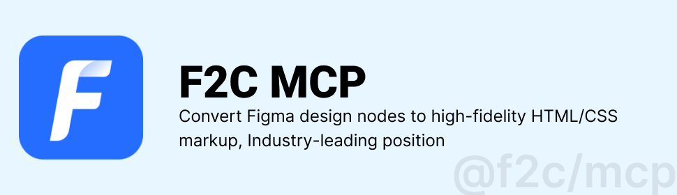

 

# F2C MCP Server
[![npm version][npm-version-src]][npm-version-href]
[![npm downloads][npm-downloads-src]][npm-downloads-href]
[![github][github-src]][github-href]
[![node][node-src]][node-href]

[npm-version-src]: https://img.shields.io/npm/v/@f2c/mcp?style=flat&colorA=18181B&colorB=F0DB4F
[npm-version-href]: https://npmjs.com/package/@f2c/mcp
[npm-downloads-src]: https://img.shields.io/npm/dm/@f2c/mcp?style=flat&colorA=18181B&colorB=F0DB4F
[npm-downloads-href]: https://npmjs.com/package/@f2c/mcp
[github-src]: https://img.shields.io/badge/github-@f2c/mcp-blue?style=flat&colorA=18181B&colorB=F0DB4F
[github-href]: https://github.com/f2c-ai/f2c-mcp
[node-src]: https://img.shields.io/node/v/@f2c/mcp?style=flat&colorA=18181B&colorB=F0DB4F
[node-href]: https://nodejs.org/en/about/previous-releases

[English](./README.md) | 简体中文

F2C MCP 服务器是一个模型上下文协议服务器，主要功能：

- 🎨 将Figma设计节点转换为**极高还原度**的HTML/CSS代码，行业内领先
- 📚 为AI编程助手提供Figma设计数据访问能力
- 🚀 支持通过Figma文件URL获取设计元数据

## 快速上手
[Getting started](docs/zh/GettingStarted.md)

## 常见问题
[FAQ](docs/zh/FAQ.md)

## 致谢

感谢：

+ [Framelink Figma MCP Server](https://github.com/GLips/Figma-Context-MCP) 通过此模型上下文协议服务器，为Cursor和其他AI编程工具提供Figma文件访问能力。  
+ [Cursor Talk to Figma MCP](https://github.com/sonnylazuardi/cursor-talk-to-figma-mcp) 允许 Cursor 与 Figma 进行通信，以便读取设计内容并通过编程方式修改它们。这种集成使开发者能够以编程方式访问和操作 Figma 中的设计元素。
+ [Figma MCP Server](https://github.com/MatthewDailey/figma-mcp) 该服务器提供直接通过ModelContextProtocol查看、评论和分析Figma设计的工具。

