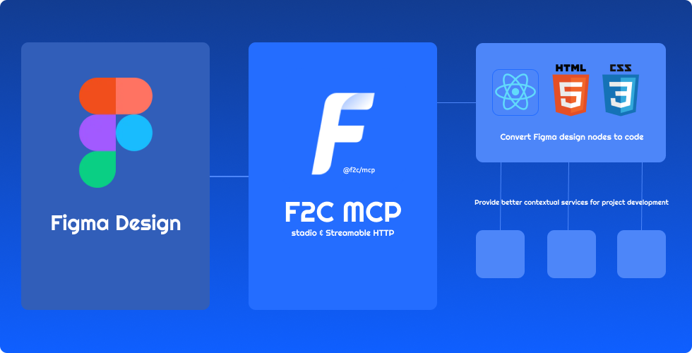

# F2C MCP
[![npm version][npm-version-src]][npm-version-href]
[![npm downloads][npm-downloads-src]][npm-downloads-href]
[![github][github-src]][github-href]
[![node][node-src]][node-href]

[npm-version-src]: https://img.shields.io/npm/v/@f2c/mcp?style=flat&colorA=18181B&colorB=F0DB4F
[npm-version-href]: https://npmjs.com/package/@f2c/mcp
[npm-downloads-src]: https://img.shields.io/npm/dm/@f2c/mcp?style=flat&colorA=18181B&colorB=F0DB4F
[npm-downloads-href]: https://npmjs.com/package/@f2c/mcp
[github-src]: https://img.shields.io/badge/github-@f2c/mcp-blue?style=flat&colorA=18181B&colorB=F0DB4F
[github-href]: https://github.com/f2c-ai/f2c-mcp
[node-src]: https://img.shields.io/node/v/@f2c/mcp?style=flat&colorA=18181B&colorB=F0DB4F
[node-href]: https://nodejs.org/en/about/previous-releases

English | [简体中文](./README-zh-CN.md) 

The F2C MCP Server is a Model Context Protocol server that enables AI coding assistants to access Figma design data and convert it to HTML/CSS code. Key features:

- 🎨 Convert Figma design nodes to high-fidelity HTML/CSS markup, Industry-leading position
- 📚 Provides Figma design context to AI coding tools like Cursor
- 🚀 Supports Figma file URLs with fileKey and nodeId parameters

## Getting started
See [Getting started](docs/en/GettingStarted.md)

## FAQ
See [FAQ](docs/en/FAQ.md)

## Credits

Thanks to:

+ [Framelink Figma MCP Server](https://github.com/GLips/Figma-Context-MCP) Give Cursor and other AI-powered coding tools access to your Figma files with this Model Context Protocol server.  
+ [Cursor Talk to Figma MCP](https://github.com/sonnylazuardi/cursor-talk-to-figma-mcp) Allowing Cursor to communicate with Figma for reading designs and modifying them programmatically.
+ [Figma MCP Server](https://github.com/MatthewDailey/figma-mcp) This server provides tools for viewing, commenting, and analyzing Figma designs directly through the ModelContextProtocol.